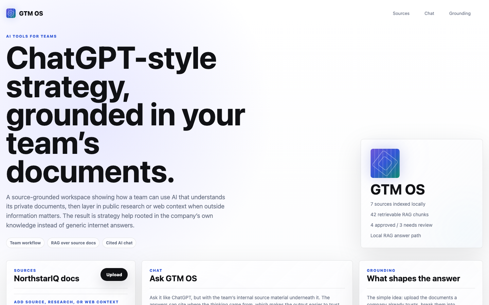

<p align="center">
  
</p>

# GTM OS

**Ask your company docs a question. Get the line it came from.** Load pricing notes, call notes, positioning memos and competitor research. Ask in plain English. Every answer comes back with the source text behind it, and clicking a citation opens that document with the exact lines marked.

The site has two parts: a landing page at `/` and the working tool at `/tool`. The tool starts empty. Load the demo set in one click, or drop in your own Markdown and text files.

The demo set is seven documents from a fictional software company. They contradict each other on purpose: two different prices, two different buyers, and a few claims that would not survive a legal review.

## Preview



## What It Does

1. **Indexes source material** from seeded Markdown documents and browser-uploaded Markdown/TXT files.
2. **Chunks and retrieves context** in the browser for local, keyless cited answers.
3. **Optionally calls a hosted model** through `/api/ask` when `OPENAI_API_KEY` is configured.
4. **Answers with citations** so reviewers can inspect the source snippets behind each response.
5. **Supports GTM workflows** such as positioning checks, pricing inconsistency reviews, objection handling, claim safety, and campaign planning.

## Business Applications

GTM OS is a reference pattern for teams that have plenty of documents but no reliable operating layer on top of them. The same approach can support:

- **Sales enablement:** turn product docs, call notes, battlecards, and pricing material into cited answers reps can trust.
- **Marketing review:** check campaign copy against positioning, compliance language, approved claims, and product reality.
- **Founder-led GTM:** keep messaging, objections, pricing, and ICP assumptions in one source-grounded workspace.
- **Customer onboarding:** answer implementation or policy questions from a controlled source set instead of relying on memory.
- **Internal knowledge QA:** identify contradictions between strategy docs, support notes, website copy, and sales collateral.

The core transferable idea is a reviewable AI workspace: answers are useful only when the user can inspect the source material behind them and decide what to do next.

## Example Questions

```text
What product are we selling?
```

```text
What pricing inconsistency should sales know?
```

```text
Where is our positioning inconsistent?
```

Each answer should cite the relevant source chunks and explain what decision the team should make next.

## Example Output

```text
Question: What pricing inconsistency should sales know?

Answer:
Sales should avoid quoting a single definitive price until pricing is reconciled. The source set contains conflicting references to package pricing, usage-based expansion, and pilot terms. The safest next step is to align on approved pricing language before using these materials in customer conversations.

Citations:
- pricing-notes.md
- sales-objections.md
- positioning-brief.md
```

## Architecture

| Layer | Implementation |
| --- | --- |
| App | Next.js App Router, React 19, TypeScript, plain CSS |
| Landing motion | GSAP tweens fired by an IntersectionObserver, Lenis smooth scroll |
| Demo material | Fictional Markdown files in `data/demo-workspace/` |
| Retrieval | `lib/rag.ts`: heading-aware chunking and BM25 scoring, in the browser |
| Write-up | Optional `/api/ask` route using OpenAI |
| Review UX | Line-accurate source reader, citation chips, copy and Markdown export |
| Python version | Streamlit implementation retained in `app.py` |

Retrieval never leaves the browser. Chunks carry their source line numbers, which is what lets the reader highlight the exact lines an answer used. With no `OPENAI_API_KEY` set, answers are assembled from the retrieved passages and the UI labels the mode as local.

## Transferable Implementation Patterns

- **Local-first retrieval:** browser-side chunking and BM25 scoring make the tool usable with no key and keep the grounding layer inspectable.
- **Line-level provenance:** passages carry line ranges, so a citation opens the document at the marked lines instead of restating a snippet.
- **Corpus-agnostic answers:** conflicting figures and absolute claims are detected from whatever is loaded, so uploads behave the same way the demo set does.
- **Optional model step:** hosted write-up improves open-ended answers without making the tool useless when the key is missing.
- **Contradiction-friendly test data:** the demo documents include realistic inconsistencies instead of a clean toy dataset.

## Run Locally

Next.js app:

```bash
npm install
npm run dev
```

Open <http://localhost:3000>. The tool lives at `/tool`.

Python Streamlit version:

```bash
uv sync
uv run streamlit run app.py
```

Open <http://localhost:8501>.

## Environment Variables

The Next.js app works without keys.

| Variable | Required | Purpose |
| --- | --- | --- |
| `OPENAI_API_KEY` | No | Enables hosted synthesis through `/api/ask` |
| `OPENAI_MODEL` | No | Overrides the hosted model |
| `FIRECRAWL_API_KEY` | No | Used only by the Python Streamlit URL-ingestion path |

## Deploy

The recommended deployment path is Vercel.

```bash
npm install
npm run build
npx vercel
```

The Vercel URL serves the usable Next.js workspace. The Dockerfile is only needed if you want to deploy the Python Streamlit version.

## Engineering Notes

- **Local-first fallback.** The main app can answer grounded questions without a hosted model.
- **Citations before confidence.** Answers point back to source chunks so a reviewer can verify support.
- **Contradictions are part of the test set.** The fictional docs intentionally include inconsistent pricing, positioning, and risk language.
- **Hosted synthesis is additive.** Model-backed answers improve open-ended reasoning but do not replace the source-grounded retrieval layer.
- **Review flows matter.** The UI makes source inspection, copying, and Markdown export visible instead of hiding them behind a chat box.

## Validation

```bash
npm run build
uv run python -m py_compile app.py src/generation/rag.py
uv run pytest -q
```

## Data and Safety

All included demo documents are fictional. Do not add real customer, employer, candidate, or confidential company data to the public repository.

## License

MIT
